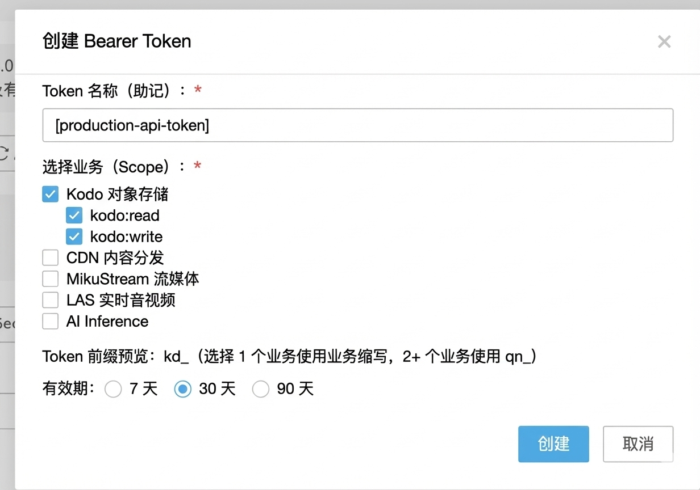

# Bearer Token Service V2 - 业务接入手册

> **面向业务接入方**: 本手册介绍如何在业务系统中验证用户的 Bearer Token,实现统一的鉴权能力。

## 📚 目录

- [核心功能:验证Token](#核心功能验证token)
- [记录用户与Token映射关系](#重要记录用户与token映射关系)
- [API接口参考](#api接口参考)
- [系统概述](#系统概述)
- [Token创建与管理](#token创建与管理)
- [权限控制](#权限控制)
- [错误码参考](#错误码参考)

---

## 核心功能:验证Token

### 业务系统如何验证Token?

**这是业务接入方最重要的功能**:在用户请求业务API时,验证用户携带的 Bearer Token 是否有效。

### 验证Token接口

```bash
POST http://bearer.qiniu.io/api/v2/validate
```

**请求头**:
```
Authorization: Bearer sk-a1b2c3d4e5f6...
```

**请求体**(可选):
```json
{
  "required_scope": "storage:write"
}
```

**响应(验证成功)**:
```json
{
  "valid": true,
  "message": "Token is valid",
  "token_info": {
    "token_id": "tk_9z8y7x6w5v4u",
    "uid": "1234567",
    "scope": ["storage:read", "storage:write"],
    "is_active": true,
    "expires_at": "2026-03-30T10:00:00Z"
  },
  "permission_check": {
    "requested": "storage:write",
    "granted": true
  }
}
```

**响应(验证失败)**:
```json
{
  "valid": false,
  "message": "Token has expired"
}
```

### 业务API集成示例

#### Python 示例

```python
import requests
from flask import Flask, request, jsonify

app = Flask(__name__)

def verify_token(bearer_token, required_scope=None):
    """验证 Bearer Token"""
    validate_url = "http://bearer.qiniu.io/api/v2/validate"

    headers = {"Authorization": f"Bearer {bearer_token}"}
    payload = {}

    if required_scope:
        payload["required_scope"] = required_scope

    response = requests.post(validate_url, headers=headers, json=payload)

    if response.status_code == 200:
        result = response.json()
        if result.get("valid"):
            return result["token_info"]  # 返回token信息,包含uid

    return None

@app.route("/api/upload", methods=["POST"])
def upload_file():
    # 从请求头获取 Bearer Token
    auth_header = request.headers.get("Authorization", "")
    token = auth_header.replace("Bearer ", "")

    # 验证 Token 并检查权限
    token_info = verify_token(token, "storage:write")
    if not token_info:
        return jsonify({"error": "Unauthorized"}), 401

    # 获取用户UID(可用于查询业务系统中的用户信息)
    uid = token_info["uid"]

    # 执行业务逻辑
    # ... 处理文件上传 ...

    return jsonify({"success": True, "uid": uid})

if __name__ == "__main__":
    app.run()
```

#### Go 示例

```go
package main

import (
    "bytes"
    "encoding/json"
    "net/http"
)

type TokenInfo struct {
    TokenID   string   `json:"token_id"`
    UID       string   `json:"uid"`
    Scope     []string `json:"scope"`
    IsActive  bool     `json:"is_active"`
    ExpiresAt string   `json:"expires_at"`
}

type ValidateResponse struct {
    Valid     bool      `json:"valid"`
    Message   string    `json:"message"`
    TokenInfo TokenInfo `json:"token_info"`
}

func verifyToken(bearerToken, requiredScope string) (*TokenInfo, error) {
    url := "http://bearer.qiniu.io/api/v2/validate"

    payload := map[string]string{}
    if requiredScope != "" {
        payload["required_scope"] = requiredScope
    }

    bodyBytes, _ := json.Marshal(payload)

    req, _ := http.NewRequest("POST", url, bytes.NewBuffer(bodyBytes))
    req.Header.Set("Authorization", "Bearer "+bearerToken)
    req.Header.Set("Content-Type", "application/json")

    client := &http.Client{}
    resp, err := client.Do(req)
    if err != nil {
        return nil, err
    }
    defer resp.Body.Close()

    var result ValidateResponse
    json.NewDecoder(resp.Body).Decode(&result)

    if result.Valid {
        return &result.TokenInfo, nil
    }

    return nil, nil
}

func uploadHandler(w http.ResponseWriter, r *http.Request) {
    // 从请求头获取 Bearer Token
    bearerToken := r.Header.Get("Authorization")
    if bearerToken == "" {
        http.Error(w, "Unauthorized", http.StatusUnauthorized)
        return
    }

    bearerToken = bearerToken[7:] // 去掉 "Bearer " 前缀

    // 验证 Token 并检查权限
    tokenInfo, err := verifyToken(bearerToken, "storage:write")
    if err != nil || tokenInfo == nil {
        http.Error(w, "Unauthorized", http.StatusUnauthorized)
        return
    }

    // 获取用户UID(可用于查询业务系统中的用户信息)
    uid := tokenInfo.UID

    // 执行业务逻辑
    // ... 处理文件上传 ...

    w.WriteHeader(http.StatusOK)
    json.NewEncoder(w).Encode(map[string]interface{}{
        "success": true,
        "uid":     uid,
    })
}
```

#### Node.js 示例

```javascript
const axios = require('axios');
const express = require('express');

const app = express();
app.use(express.json());

async function verifyToken(bearerToken, requiredScope = null) {
    const url = 'http://bearer.qiniu.io/api/v2/validate';
    const headers = { 'Authorization': `Bearer ${bearerToken}` };
    const payload = {};

    if (requiredScope) {
        payload.required_scope = requiredScope;
    }

    try {
        const response = await axios.post(url, payload, { headers });
        if (response.data.valid) {
            return response.data.token_info;
        }
    } catch (error) {
        console.error('Token validation failed:', error.message);
    }

    return null;
}

app.post('/api/upload', async (req, res) => {
    // 从请求头获取 Bearer Token
    const authHeader = req.headers.authorization || '';
    const token = authHeader.replace('Bearer ', '');

    // 验证 Token 并检查权限
    const tokenInfo = await verifyToken(token, 'storage:write');
    if (!tokenInfo) {
        return res.status(401).json({ error: 'Unauthorized' });
    }

    // 获取用户UID(可用于查询业务系统中的用户信息)
    const uid = tokenInfo.uid;

    // 执行业务逻辑
    // ... 处理文件上传 ...

    res.json({ success: true, uid });
});

app.listen(3000);
```

### 关键要点

1. **在每个业务API请求中调用验证接口**
2. **检查返回的 `valid` 字段判断Token是否有效**
3. **可选:检查 `permission_check.granted` 验证权限**
4. **使用返回的 `uid` 查询业务系统中的用户信息**

---

## 记录用户与Token映射关系

### ⚠️ 为什么必须记录

**Bearer Token Service 不存储用户业务信息**（如用户名、邮箱、手机号等），仅管理 Token 的生命周期和权限。

**因此业务系统必须在自己的数据库中记录用户信息与 Token 的映射关系！**

**具体原因**：
1. **Token验证接口只返回 `uid` 和权限**，不返回用户业务信息
2. **便于后续按用户身份记录、统计、审计资源用量等**

### 建议的数据库表结构

```sql
CREATE TABLE user_tokens (
    id BIGINT PRIMARY KEY AUTO_INCREMENT,

    -- 业务系统用户ID（关联到你的 users 表）
    user_id BIGINT NOT NULL,

    -- 业务用户信息（冗余存储，方便查询）
    username VARCHAR(255),
    email VARCHAR(255),

    -- ⚠️ 重要：七牛UID（验证Token接口返回的uid字段）
    -- 用于关联七牛云账号体系和业务系统用户
    qiniu_uid VARCHAR(255) NOT NULL,

    -- Token信息
    token_id VARCHAR(255) NOT NULL,
    token_hash VARCHAR(255),               -- Token哈希(可选,建议存储)
    description VARCHAR(500),              -- Token用途描述
    scope JSON,                            -- 权限范围
    created_at DATETIME DEFAULT NOW(),     -- 创建时间
    expires_at DATETIME,                   -- 过期时间

    INDEX idx_user_id (user_id),
    INDEX idx_qiniu_uid (qiniu_uid),       -- ⚠️ 重要：根据验证返回的uid查询
    INDEX idx_token_id (token_id),
    UNIQUE KEY uk_token_id (token_id)
);
```

**字段说明**:

| 字段 | 说明 | 来源 |
|------|------|------|
| `user_id` | 业务系统的用户ID | 你的业务系统 `users` 表主键 |
| `qiniu_uid` | 七牛云用户ID | **验证Token接口返回的 `uid` 字段** ⚠️ |
| `username`, `email` | 业务用户信息 | 你的业务系统用户数据 |


---

## API接口参考

> **说明**: 以下是业务接入方可能需要的查询类接口，用于获取Token信息、统计数据和审计日志。Token的创建、删除、状态更新等操作由用户在管理网站完成。

### 认证方式: QiniuStub

调用以下API需要使用 QiniuStub 认证方式。

**请求头格式**:
```
Authorization: QiniuStub uid={用户ID}&ut={用户类型}
```

**示例**:
```bash
Authorization: QiniuStub uid=1369077332&ut=1
```

**参数说明**:
- `uid`: 七牛用户 ID
- `ut`: 用户类型(通常为 1)

### 1. 列出 Tokens

获取当前用户的所有Token列表。

```bash
GET /api/v2/tokens?active_only=true&limit=50&offset=0
```

**请求头**:
```
Authorization: QiniuStub uid=1369077332&ut=1
```

**查询参数**:

| 参数 | 类型 | 默认值 | 说明 |
|------|------|--------|------|
| active_only | boolean | false | 仅显示激活的 Token |
| limit | integer | 50 | 返回数量(最大 100) |
| offset | integer | 0 | 偏移量 |

**响应示例**:
```json
{
  "account_id": "acc_1a2b3c4d5e6f",
  "tokens": [
    {
      "token_id": "tk_9z8y7x6w5v4u",
      "token_preview": "sk-a1b2c3d4e5f6g7******************************c9d0e1f2",
      "description": "Production API Token",
      "scope": ["storage:read", "storage:write"],
      "created_at": "2025-12-30T10:00:00Z",
      "expires_at": "2026-03-30T10:00:00Z",
      "is_active": true,
      "status": "normal",
      "total_requests": 12567,
      "last_used_at": "2025-12-30T09:45:00Z"
    }
  ],
  "total": 1
}
```

**Status 字段说明**:
- `normal`: 正常(未过期且已激活)
- `expired`: 已过期
- `disabled`: 已停用

### 2. 获取 Token 详情

获取指定Token的详细信息。

```bash
GET /api/v2/tokens/{token_id}
```

**请求头**:
```
Authorization: QiniuStub uid=1369077332&ut=1
```

**响应示例**:
```json
{
  "token_id": "tk_9z8y7x6w5v4u",
  "token_preview": "sk-a1b2c3d4e5f6g7******************************c9d0e1f2",
  "account_id": "acc_1a2b3c4d5e6f",
  "description": "Production API Token",
  "scope": ["storage:read", "storage:write"],
  "created_at": "2025-12-30T10:00:00Z",
  "expires_at": "2026-03-30T10:00:00Z",
  "is_active": true,
  "status": "normal",
  "total_requests": 12567,
  "last_used_at": "2025-12-30T09:45:00Z"
}
```

### 3. 获取 Token 使用统计

获取Token的使用统计信息。

```bash
GET /api/v2/tokens/{token_id}/stats
```

**请求头**:
```
Authorization: QiniuStub uid=1369077332&ut=1
```

**响应示例**:
```json
{
  "token_id": "tk_9z8y7x6w5v4u",
  "total_requests": 12567,
  "last_used_at": "2025-12-30T09:45:00Z",
  "created_at": "2025-12-30T10:00:00Z"
}
```

### 4. 查询审计日志

查询Token相关的操作审计日志。

```bash
GET /api/v2/audit-logs?action=create_token&limit=50
```

**请求头**:
```
Authorization: QiniuStub uid=1369077332&ut=1
```

**查询参数**:

| 参数 | 类型 | 说明 |
|------|------|------|
| action | string | 过滤操作类型(如 `create_token`, `delete_token`, `validate_token`) |
| resource_id | string | 过滤资源 ID（如 token_id） |
| start_time | string | 开始时间(ISO 8601格式) |
| end_time | string | 结束时间(ISO 8601格式) |
| limit | integer | 返回数量(默认 50) |
| offset | integer | 偏移量(默认 0) |

**响应示例**:
```json
{
  "account_id": "acc_1a2b3c4d5e6f",
  "logs": [
    {
      "id": "log_xyz123",
      "account_id": "acc_1a2b3c4d5e6f",
      "action": "create_token",
      "resource_id": "tk_9z8y7x6w5v4u",
      "ip": "203.0.113.42",
      "user_agent": "Mozilla/5.0...",
      "result": "success",
      "timestamp": "2025-12-30T10:00:00Z"
    }
  ],
  "total": 1
}
```

**常见的审计操作类型**:
- `create_token`: 创建Token
- `delete_token`: 删除Token
- `update_token_status`: 更新Token状态
- `validate_token`: 验证Token
- `view_token`: 查看Token详情

---

## 系统概述

### 什么是 Bearer Token Service?

Bearer Token Service 是**七牛云统一的 Bearer Token 鉴权服务**,在七牛内网环境运行,为所有内部业务系统提供统一的 Token 管理和验证能力。

**系统定位**:
- 🏢 **内网服务**: 部署在七牛内网,仅供内部业务系统访问
- 🔐 **统一鉴权**: 作为七牛云的统一 Bearer Token 鉴权中心
- 🌐 **服务地址**: `http://bearer.qiniu.io`(仅内网可访问)

**核心能力**:
- **Bearer Token 管理**: 创建、管理、验证 API Token
- **细粒度权限控制**: 基于 Scope 的权限系统
- **安全性保障**: Token 过期管理、状态控制

### 适用场景

- API 服务的访问认证
- 微服务之间的鉴权
- 第三方应用接入
- 移动端/前端应用认证
- 自动化脚本/CI/CD 工具认证

---

## Token创建与管理

**Token的创建、删除、状态更新等操作由用户在七牛管理网站完成**，不是业务接入方的职责。

### 用户Token管理流程

1. 用户通过七牛官网注册登录
2. 在密钥管理页面为各业务线创建和管理 Token
3. 可以执行以下操作:
   - 创建新的Token（指定权限scope、过期时间等）
   - 查看Token列表
   - 禁用/启用Token
   - 删除Token



### 用户身份信息

- **UID**: 七牛用户 ID（如 `1369077332`）
- **UT**: 用户类型（通常为 `1`）

### 管理网站使用的认证方式: QiniuStub

七牛内部管理服务使用 QiniuStub 认证方式进行身份验证。

**请求头格式**:
```
Authorization: QiniuStub uid={用户ID}&ut={用户类型}
```

**示例**:
```bash
Authorization: QiniuStub uid=1369077332&ut=1
```

> **注意**: 业务接入方无需关心Token的创建和管理接口，只需要调用验证接口即可。

---

## 权限控制

### 设计思路

Bearer Token 使用 **Scope 权限系统**实现细粒度的访问控制。其核心设计思想是：

- **资源-动作模型**: 使用 `<resource>:<action>` 格式明确描述权限范围
- **最小权限原则**: Token 仅授予完成任务所需的最小权限集
- **灵活的通配符**: 支持前缀通配和全局通配，平衡灵活性与安全性
- **显式验证**: 业务系统在 API 调用时显式指定所需权限，服务端进行匹配验证

### 使用方法

1. **创建 Token 时指定 Scope**（由用户在管理网站完成）
   - 根据业务需求选择合适的权限组合
   - 使用通配符简化权限配置（如 `storage:*` 授予所有存储权限）

2. **业务 API 验证时指定所需权限**（业务接入方实现）
   - 在调用验证接口时传递 `required_scope` 参数
   - 服务端返回权限检查结果 `permission_check.granted`

### Scope 权限系统

#### Scope 格式

```
<resource>:<action>
```

**格式说明**:
- `resource`: 资源类型（如 `storage`、`cdn`、`mikustream`）
- `action`: 操作动作（如 `read`、`write`、`refresh`）
- 分隔符: 使用冒号 `:` 连接

**示例**:
- `storage:read` - 存储读权限
- `storage:write` - 存储写权限
- `cdn:refresh` - CDN 刷新权限
- `analytics:view` - 分析查看权限

#### 通配符支持

**前缀通配符 `*`**:
```json
{
  "scope": ["storage:*"]
}
```
匹配所有以 `storage:` 开头的权限:
- `storage:read` ✅
- `storage:write` ✅
- `storage:delete` ✅
- `cdn:refresh` ❌（不同资源）

**全局通配符 `*`**:
```json
{
  "scope": ["*"]
}
```
匹配所有权限（⚠️ 慎用）

#### 权限验证逻辑

验证时使用**"最宽松匹配"**原则，按以下顺序检查：

1. **精确匹配**: Token 的 Scope 包含请求的权限
   ```
   Token Scope: ["storage:read", "storage:write"]
   Required: "storage:read"
   Result: ✅ Granted
   ```

2. **前缀通配匹配**: Token 的 Scope 包含通配符前缀
   ```
   Token Scope: ["storage:*"]
   Required: "storage:read"
   Result: ✅ Granted
   ```

3. **全局通配匹配**: Token 的 Scope 包含 `*`
   ```
   Token Scope: ["*"]
   Required: "any:permission"
   Result: ✅ Granted
   ```

4. **无匹配**: Token 没有对应权限
   ```
   Token Scope: ["storage:read"]
   Required: "storage:write"
   Result: ❌ Denied
   ```

### 最佳实践

#### 1. 按需授权原则

**✅ 推荐：精确授权**
```json
{
  "description": "Mobile App Read Token",
  "scope": ["storage:read", "analytics:view"]
}
```

**❌ 不推荐：过度授权**
```json
{
  "description": "Mobile App Token",
  "scope": ["*"]
}
```

#### 2. 按环境管理

**开发环境：较宽松，短有效期**
```json
{
  "description": "Development Token",
  "scope": ["storage:*", "cdn:*"],
  "expires_in_seconds": 86400  // 1天
}
```

**生产环境：最小权限，长有效期**
```json
{
  "description": "Production Read-Only Token",
  "scope": ["storage:read"],
  "expires_in_seconds": 7776000  // 90天
}
```

#### 3. 按角色授权

**管理员（全权限）**
```json
{
  "description": "Admin Token",
  "scope": ["*"]
}
```

**开发者（多产品读写）**
```json
{
  "description": "Developer Token",
  "scope": ["storage:*", "cdn:refresh", "mikustream:write"]
}
```

**只读用户（查看权限）**
```json
{
  "description": "Read-Only Token",
  "scope": ["storage:read", "analytics:view"]
}
```

#### 4. 产品线权限规范参考

以下是七牛云各产品线推荐的 Scope 命名规范：

##### **Kodo（对象存储）**
```json
{
  "product": "kodo",
  "scope": [
    "kodo:read",           // 读取对象
    "kodo:write",          // 上传对象
    "kodo:delete",         // 删除对象
    "kodo:list",           // 列举对象
    "kodo:bucket:create",  // 创建空间
    "kodo:bucket:delete"   // 删除空间
  ]
}
```

**常用组合**:
- 只读访问: `["kodo:read", "kodo:list"]`
- 上传下载: `["kodo:read", "kodo:write"]`
- 完全控制: `["kodo:*"]`

##### **CDN（内容分发网络）**
```json
{
  "product": "cdn",
  "scope": [
    "cdn:refresh",         // 刷新缓存
    "cdn:prefetch",        // 预取文件
    "cdn:domain:config",   // 配置域名
    "cdn:log:view",        // 查看日志
    "cdn:bandwidth:view"   // 查看带宽统计
  ]
}
```

**常用组合**:
- 运维操作: `["cdn:refresh", "cdn:prefetch"]`
- 查看统计: `["cdn:log:view", "cdn:bandwidth:view"]`
- 完全控制: `["cdn:*"]`

##### **MikuStream（实时流媒体）**
```json
{
  "product": "mikustream",
  "scope": [
    "mikustream:stream:create",   // 创建流
    "mikustream:stream:publish",  // 推流
    "mikustream:stream:play",     // 拉流
    "mikustream:stream:stop",     // 断流
    "mikustream:record:list",     // 查看录制
    "mikustream:snapshot:view"    // 查看截图
  ]
}
```

**常用组合**:
- 推流端: `["mikustream:stream:publish"]`
- 播放端: `["mikustream:stream:play"]`
- 录制管理: `["mikustream:stream:*", "mikustream:record:*"]`

##### **LAS（实时音视频）**
```json
{
  "product": "las",
  "scope": [
    "las:room:create",      // 创建房间
    "las:room:join",        // 加入房间
    "las:room:leave",       // 离开房间
    "las:stream:publish",   // 发布流
    "las:stream:subscribe", // 订阅流
    "las:record:start"      // 开始录制
  ]
}
```

**常用组合**:
- 主播权限: `["las:room:create", "las:stream:publish"]`
- 观众权限: `["las:room:join", "las:stream:subscribe"]`
- 完全控制: `["las:*"]`

##### **AI Inference（AI 推理服务）**
```json
{
  "product": "ai-inference",
  "scope": [
    "ai-inference:model:list",       // 列举模型
    "ai-inference:model:deploy",     // 部署模型
    "ai-inference:model:undeploy",   // 卸载模型
    "ai-inference:predict",          // 执行推理
    "ai-inference:batch:submit",     // 提交批量任务
    "ai-inference:metrics:view"      // 查看指标
  ]
}
```

**常用组合**:
- 推理调用: `["ai-inference:predict"]`
- 模型管理: `["ai-inference:model:*"]`
- 完全控制: `["ai-inference:*"]`

#### 5. 跨产品授权示例

**多产品开发者**
```json
{
  "description": "Multi-Product Developer Token",
  "scope": [
    "kodo:*",
    "cdn:refresh",
    "mikustream:stream:*"
  ],
  "expires_in_seconds": 2592000  // 30天
}
```

**监控只读用户**
```json
{
  "description": "Monitoring Read-Only Token",
  "scope": [
    "kodo:list",
    "cdn:log:view",
    "cdn:bandwidth:view",
    "mikustream:record:list",
    "ai-inference:metrics:view"
  ],
  "expires_in_seconds": 7776000  // 90天
}
```

#### 6. 安全建议

- ⚠️ **避免使用全局通配符 `*`**，除非确实需要管理员权限
- ✅ **定期轮换 Token**，建议生产 Token 有效期不超过 90 天
- ✅ **区分环境**，开发/测试/生产使用不同的 Token
- ✅ **记录 Token 用途**，在 `description` 字段清楚描述用途
- ✅ **监控 Token 使用**，通过审计日志发现异常访问

---

## 错误码参考

### HTTP 状态码

| 状态码 | 说明 | 处理方式 |
|--------|------|----------|
| 200 | 成功 | - |
| 201 | 创建成功 | - |
| 400 | 请求参数错误 | 检查请求体格式和参数 |
| 401 | 认证失败 | 检查 QiniuStub 认证参数或 Bearer Token |
| 403 | 权限不足 | 检查 Token 的 Scope 权限 |
| 404 | 资源不存在 | 检查 Token ID 或资源 ID |
| 500 | 服务器内部错误 | 联系管理员 |
| 503 | 服务不可用 | 稍后重试 |

### 业务错误码

**认证相关(4001-4099)**:

| 错误码 | 消息 | 说明 |
|--------|------|------|
| 4004 | Invalid bearer token | Bearer Token 无效 |
| 4005 | Token has expired | Token 已过期 |
| 4006 | Token is disabled | Token 已被禁用 |

**权限相关(4031-4099)**:

| 错误码 | 消息 | 说明 |
|--------|------|------|
| 4031 | Permission denied | 权限不足 |
| 4032 | Insufficient scope | Scope 权限不足 |

**资源相关(4041-4099)**:

| 错误码 | 消息 | 说明 |
|--------|------|------|
| 4041 | Token not found | Token 不存在 |
| 4042 | Account not found | 账户不存在 |

**请求相关(4001-4299)**:

| 错误码 | 消息 | 说明 |
|--------|------|------|
| 4291 | Too many requests | 请求频率超限 |
| 4292 | Rate limit exceeded | Token 频率限制超限 |
